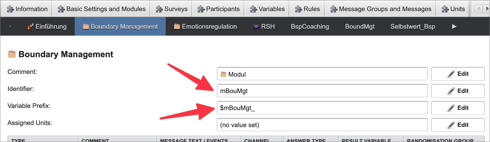
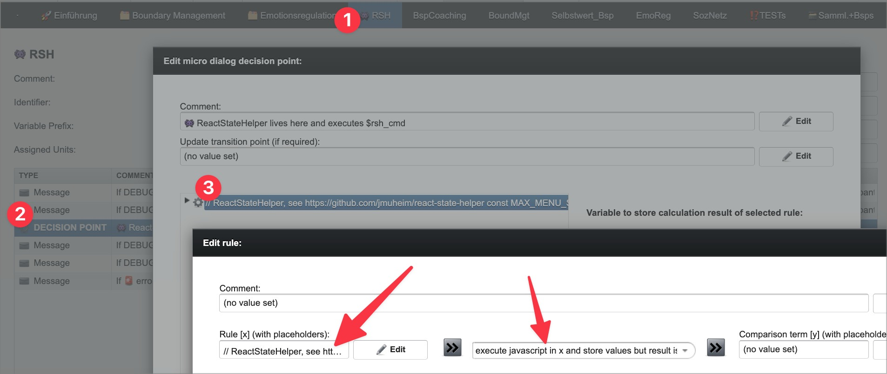

# Developer guide

Architecture, platform internals, and MobileCoach setup of ReactStateHelper.

## Data model

State is a JSON tree managed by four classes in [`src/ReactStateHelper.js`](https://github.com/jmuheim/react-state-helper/blob/master/src/ReactStateHelper.js):

```
👾 ReactStateHelper
└── 🗂️ modules: Module[]
    └── 📑 sessions: Session[]
        └── 🎯 activities: Activity[]
```

| Class | Fields (beyond `id` / `title` / `entered_first_at` / `entered_last_at` / `times_entered`) | Notes |
|---|---|---|
| `Module` | `sessions_needed_for_adequate_progress`, `sessions[]` | Top-level grouping, e.g. "Boundary Management" |
| `Session` | `activities_needed_for_adequate_progress`, `activities[]`, `is_intro` | `is_intro: true` marks a session that has no activities by design (e.g. an introduction) and counts as completed once entered; it must be the module's first session, and every other session must have at least one activity |
| `Activity` | `completed` | Bottom of the hierarchy — contains no children; flips to `true` via `completeActivity()` |

- **Completion**: activities are the only things marked completed directly; sessions and modules derive their completion by aggregating completion status of their children. An `Activity` is completed once marked. A **regular** `Session` (`is_intro: false`) is completed if it has at least one activity and all of them are completed; an **intro** session (`is_intro: true`) has no activities and is instead completed the moment it has been entered once. A `Module` is completed if **all** of its sessions are completed — intro sessions included, which is why they must be entered rather than being skipped.
- **Adequate progress**: a softer bar than full completion — a `Module` has adequate progress once `sessions_needed_for_adequate_progress` of its children are completed. For example: a module contains 4 sessions, but only 3 need to be completed for adequate progress. The same logic applies to `Session` with `activities_needed_for_adequate_progress`. Used to decide e.g. whether to nudge the participant onward instead of insisting they finish everything: whenever an activity is marked as complete, the user gets some advice on how to continue in the flow — the ready-to-display advice sentence in [`$rsh_progressAdvice`](#flow-logic-commands) is built from this.

## Architecture

All logic lives in `src/ReactStateHelper.js`. There are four classes:

| Class | Emoji | Role |
|---|---|---|
| `Activity` | 🎯 | Bottom of the hierarchy — tracks `completed`, `times_entered`, timestamps |
| `Session` | 📑 | Contains activities; `isCompleted()` if all activities completed (or, for an intro session, once entered) |
| `Module` | 🗂️ | Contains sessions; exposes `countCompletedSessions`, `getProgress` |
| `ReactStateHelper` | 👾 | Public API; holds `#state` (private); navigated via `current_module_id / current_session_id / current_activity_id`. The ubiquitous **rsh** abbreviation (e.g. the `$rsh_json` variable prefix) is its initials |

### ID conventions

Module, session, and activity ids must be unique across the *entire* state, not just within their parent — MobileCoach maps each one to a separate dialog, and menu routing (see [Menus](#menus) below) navigates directly to the dialog named after the tapped id — one flat namespace, so a duplicate would be ambiguous. The exact same id string must therefore be used consistently in the state definition **and** in MobileCoach (dialog names, variable prefixes).



Every id starts with its level letter — `m` for modules, `s` for sessions, `a` for activities — followed by an uppercase letter, and contains only letters and numbers (e.g. `mBouMgt`, `sAkzep`, `aRolGes`). Each id also works as the MobileCoach dialog's **variable prefix** (with an underscore appended, e.g. `$mBouMgt_`). No other format rules are enforced, except uniqueness.

### State validation

State — the id rules above included — is validated as it loads: a violation makes loading fail immediately, surfaced through [`$rsh_error`](#one-time-mobilecoach-setup) instead of crashing the whole script silently — see [Command dispatch](#command-dispatch) below.

Checked at load, besides the id rules: the size minimums from the [data model](#data-model) above (every non-intro session needs at least one activity, every module at least one session with activities) and the structural caps — at most **9** modules, **8** sessions per module, **7** activities per session — which fall out of the menu slot layout (see [Back entries](#back-entries)).

### Navigation model

Navigation happens through a single `enter(id)` command: the id's level letter (`m`/`s`/`a`) determines whether a module, session, or activity is entered — one command therefore works after any menu tap, regardless of the menu's level; but always be sure to enter module → session → activity in order. These calls record timestamps and increment `times_entered` for each element. Much of the internal logic relies on the current location stored in state (`current_module_id` / `current_session_id` / `current_activity_id`) — which is why many commands require entering first.

## Tests

```bash
npm test              # run all tests once
npm run test:watch    # re-run on file changes
```

Run the tests after **every** change — even one that only touches the state JSON: besides the behavior, they check the [structural limits](#state-validation) and the [MobileCoach platform constraints](#mobilecoach--pathmate-platform-constraints) that would otherwise only fail inside MobileCoach, usually silently.

## Working with Claude Code

The repo is set up for [Claude Code](https://claude.com/claude-code) ([CLI](https://docs.claude.com/en/docs/claude-code/setup) or [VS Code extension](https://marketplace.visualstudio.com/items?itemName=anthropic.claude-code)); the configuration lives in `CLAUDE.md` (project context, loaded automatically at session start) and `.claude/`. It is suggested to do all work through Claude prompts, so the compiled conventions, insights, commands, hooks, and safeguards are taken into account — no other tools are necessary, not even for installing software dependencies.

Good to know: `master` is protected by the `protect-master` [GitHub ruleset](https://github.com/jmuheim/react-state-helper/settings/rules) — changes normally only land via a [pull request (PR)](https://github.com/jmuheim/react-state-helper/pulls) with a passing "test" status check ([continuous integration (CI)](https://github.com/jmuheim/react-state-helper/actions) runs `npm test` on every PR). For small changes (typo/doc fixes) where a PR is overhead, the `/push-to-master` command pushes master directly, temporarily bypassing the protection.

## One-time MobileCoach setup

1. Copy the full contents of [`src/ReactStateHelper.js`](https://github.com/jmuheim/react-state-helper/blob/master/src/ReactStateHelper.js) **as-is** into MobileCoach:



2. Create the following variables in your MobileCoach project — every single one, each with default value `0` and access **"manageable by service"**:

   | Variable | Purpose |
   |---|---|
   | `$rsh_cmd` | Command to execute, e.g. `completeActivity()` (see [Running a command](#running-a-command)) |
   | `$rsh_json` | Full serialized state, persisted between runs; initialised automatically on the very first run (see [State persistence](#state-persistence)) |
   | `$rsh_result` | Return value of the last command; `""` when the command returns nothing (`enter(…)`, `completeActivity()`, the `populateMenuWith…()` commands, …) |
   | `$rsh_status` | `success` or `error` |
   | `$rsh_error` | Error message if status is `error`, otherwise `none` |
   | `$rsh_progressAdvice` | Ready-to-display advice sentence about how to continue (see [`getProgressAdvice()`](#flow-logic-commands)), refreshed on **every** run; `""` until a module has been entered |
   | `$rsh_moduleTimesEntered` | How many times the participant's current module has been entered, refreshed on **every** run; `""` while no module has been entered yet |
   | `$rsh_sessionTimesEntered` | Same for the current session; `""` while no session is current (entering a module clears the current session) |
   | `$rsh_activityTimesEntered` | Same for the current activity; `""` while no activity is current (entering a module or session clears the current activity) |
   | `$rsh_moduleCompleted` | Whether the participant's current module is completed, refreshed on **every** run (returning `true` or `false` as texts, not booleans); `""` while no module has been entered yet |
   | `$rsh_sessionCompleted` | Same for the current session; `""` while no session is current (entering a module clears the current session) |
   | `$rsh_activityCompleted` | Same for the current activity; `""` while no activity is current (entering a module or session clears the current activity) |
   | `$rsh_menuLabel1` – `$rsh_menuLabel9` | Dynamic menu entry labels (`"<level emoji> <title>[ <status emoji>]"`, e.g. `🗂️ Emotionsregulation ✅`, `📑 Gesunde Grenzen setzen 👈`, `🎯 Rollenwechsel bewusst gestalten`) populated by `populateMenuWithModules()` / `populateMenuWithSessions()` / `populateMenuWithActivities()`. Any other command resets all slots to `""` |
   | `$rsh_menuId1` – `$rsh_menuId9` | The id belonging to the label in the same slot (e.g. `mEmoReg`); concatenated with its label in the menu definition (see [Menus](#menus)). Same reset behavior as the labels |
   | `$participantGroup` | **Already exists by default in MobileCoach — do not create it** (we "mis-use" it, as it is one of the few easily inspectable variables from within MobileCoach). Carries the participant's location  and a one-line snapshot of the whole completion state, e.g. `Participant location: 🗂️mBouMgt: 📑sGesGre \| Completion overview: 🗂️mBouMgt[📑sBouIntro✅ 📑sGesGre✅(🎯aRolGes✅ 🎯aAbgKon✅) 📑sPaus(🎯aMikPau)]` |

3. Also declare the two banner variables — the only ones whose default is **not** `0`: `$debugBanner` with default value `⚠️ DEBUGGER INFO ⚠️`, and `$errorBanner` with default value `🚨 ERROR INFO 🚨`. The script never touches them; flows prepend `$debugBanner` to every DEBUGGER-facing message and `$errorBanner` to every error message — participants see the latter too (see the [banner field note](mobilecoach-field-notes.md#coach-selection-and-debug-coaches)).

**⚠️ The silent-failure gotcha:** If any variable is missing or has the wrong access setting, the script fails silently and halts the flow mid-conversation — with **no error output** whatsoever. This is extremely painful to debug. Before testing anything, double-check that *every* variable in the table above is declared correctly.

## Running a command

MobileCoach cannot call JavaScript functions directly. Instead, each script run works like this:

1. Set `$rsh_cmd` to the command you want, e.g. `completeActivity()` — exactly as written in the cheat-sheet below.
2. Execute the script (cascade to "👾 RSH" dialog, see [One-time MobileCoach setup](#one-time-mobilecoach-setup)).
3. Read the results: the command's return value is in `$rsh_result` (`""` for commands that return nothing), `$rsh_status` is `success` or `error` (inspect `$rsh_error` for a detailed error message).

After each run the script writes **all** variables from the [table above](#one-time-mobilecoach-setup), regardless of whether they are related to the executed command (see the [command cheat-sheet](#command-cheat-sheet) below) — the only one you ever set yourself is `$rsh_cmd`.

## Command cheat-sheet

Day to day, flows drive the library with three kinds of **doer** commands: **entering** a module/session/activity (see [Navigation model](#navigation-model)), **marking an activity completed** (see the completion rules in the [data model](#data-model)), and **populating a menu** (see [Menus](#menus)). Calling a command without its preconditions results in `$rsh_status` = `error`.

| Command (value of `$rsh_cmd`) | Preconditions | Effect |
|---|---|---|
| `enter('mBouMgt')` | — | Sets the current module (and clears session/activity); records visit timestamps and count |
| `enter('sGesGre')` | module entered | Sets the current session (and clears activity); records visit timestamps and count |
| `enter('aRolGes')` | module + session entered | Sets the current activity; records visit timestamps and count |
| `completeActivity()` | module + session + activity entered | Marks the current activity as completed |
| `populateMenuWithModules()` | — | Fills `$rsh_menuLabel1–9` and `$rsh_menuId1–9` with one entry per module |
| `populateMenuWithSessions()` | module entered | Fills the labels and ids with the current module's sessions, plus a back entry (`Ein anderes 🗂️ Modul wählen` — see [Back entries](#back-entries)) |
| `populateMenuWithActivities()` | module + session entered | Fills the labels and ids with the current session's activities, plus two back entries (`Eine andere 📑 Session wählen`, then `Ein anderes 🗂️ Modul wählen` — see [Back entries](#back-entries)) |

For decisions in a flow (e.g. showing a different message once the current module is completed) and for displaying the participant's status (e.g. the progress advice), no command is needed: the completion flags, times-entered counters, and the advice text are auto-written to `$rsh_` variables on every run — see the [variable table](#one-time-mobilecoach-setup) and [Flow-logic commands](#flow-logic-commands) below.

## Menus

MobileCoach has no dynamic list/loop constructs for building menus — menu entries are hard-coded in the flow. The workaround is to pre-declare a fixed number of `$rsh_menuLabel1`–`$rsh_menuLabel9` and `$rsh_menuId1`–`$rsh_menuId9` variables and auto-populate them:

1. Call one of the `populateMenuWith…()` commands (see the [cheat-sheet](#command-cheat-sheet) for their preconditions) **immediately before displaying the menu** — every other command resets all slots to `""`. It fills the label and id slot variables (see the [variable table](#one-time-mobilecoach-setup)); unused slots are set to `""` so MobileCoach can hide them.
2. In the menu definition, concatenate label and id per slot with a colon: `$rsh_menuLabel1:$rsh_menuId1` (for menu item 1). MobileCoach splits on `:` when the button is tapped — the **left** side is displayed to the participant, the **right** side (the id) is stored to the reserved variable `$participantNextMicroDialogIdentifier` ([field note](mobilecoach-field-notes.md#the-tapped-menu-id-lands-in-participantnextmicrodialogidentifier)).
3. MobileCoach reads that variable and navigates directly to the dialog with that id (which must exist under exactly that name — see [ID conventions](#id-conventions)).

The `:`-split happens on the **raw definition text, before variable interpolation** — colons inside variable values are not treated as separators ([field note](mobilecoach-field-notes.md#menu-entries-split-on-the-raw-definition-text-not-on-variable-content)). Titles are nevertheless still rejected at state load if they contain a colon; that validation predates this insight, and whether to drop it is an [open question](open-questions.md#drop-the-title-colon-validation).

Each label is formatted as `"<level emoji> <title>[ <status emoji>]"` — the level emoji (🗂️/📑/🎯) always prefixes the title, and a status emoji (✅ completed, 👈 next up) is appended after it where applicable (e.g. `"🗂️ Emotionsregulation ✅"`). All emojis come from the `#EMOJIS` map in the source:

| Key | Emoji | Used for |
|---|---|---|
| `module` | 🗂️ | prefixed to every modules-menu label, to quoted module titles in `getProgressAdvice()` (`Modul "🗂️ Modul Eins"` — inside the quotes, matching the menu-label format), to module ids in the completion snapshot inside `$participantGroup` (there without a space), and used in the sessions and activities menus' back entries |
| `session` | 📑 | prefixed to every sessions-menu label, to quoted session titles in `getProgressAdvice()`, to session ids in the completion snapshot (no space), and used in the activities menu's back entry |
| `activity` | 🎯 | prefixed to every activities-menu label, to quoted activity titles in `getProgressAdvice()`, and to activity ids in the completion snapshot (no space) |
| `completed` | ✅ | appended to a completed item in a menu, and to a completed item's id in the completion snapshot inside `$participantGroup` |
| `next` | 👈 | appended to the first not-yet-completed item in a menu (menus only) |

Menu items that are neither completed nor the next one get no status emoji — just the level prefix.

### Back entries

The sessions and activities menus automatically append **back entries** in the slots after their last item:

- Sessions menu: `Ein anderes 🗂️ Modul wählen`, routing to the dialog id `allModulesMenu` — **name the dialog that shows the module-selection menu (the one calling `populateMenuWithModules()`) exactly `allModulesMenu`**, or the back entry leads nowhere (a tap on an id without a matching dialog silently pauses the flow, see the [field note](mobilecoach-field-notes.md#a-participantnextmicrodialogidentifier-without-a-matching-dialog-pauses-the-flow-silently)). Where the dialog lives doesn't matter — in our setup it is currently a sub-dialog of the *Einführung* dialog — only its id does. *(TODO: it probably won't stay there — the plan is to move it into the "Magic Menu" dialog, since it is called again and again from within modules; keeping it in the Einführung only reflects that that's where it is displayed first.)*
- Activities menu: `Eine andere 📑 Session wählen`, routing to the dialog id `allSessionsOfCurrentModuleMenu` — **name the dialog that shows the session-selection menu (the one calling `populateMenuWithSessions()`) exactly `allSessionsOfCurrentModuleMenu`**, same silent-failure trap as above — followed by `Ein anderes 🗂️ Modul wählen`, routing to `allModulesMenu` just like the sessions menu's entry, so a participant can switch modules without hopping through the sessions menu first.

A back tap involves no library command — `enter('allModulesMenu')` and `enter('allSessionsOfCurrentModuleMenu')` are **never** called (doing so by mistake puts a dedicated "… must never be entered" message into `$rsh_error`). While a menu reached via a back entry is displayed, the participant's tracked location simply stays in the previous context; it changes when the tapped entry's dialog runs its own `enter(…)` (entering a module clears the current session/activity as usual). Back entries never get a level prefix or the ✅/👈 status emoji — their labels are fixed. The modules menu has no back entry — it is already the top level.

To guarantee the back entries always have free slots, state validation caps sessions per module at `MAX_MENU_SLOTS - 1` (8) and activities per session at `MAX_MENU_SLOTS - 2` (7); the module count stays capped at 9, since the top-level menu has no back entry.

Good to know:

- The wrapper writes all nine label and all nine id variables on **every** run — a run whose command isn't one of the `populateMenuWith…()` methods resets them to `""`. Stale entries can't survive, but a menu must be (re)populated right before it is displayed.
- The number of slots (9) is a self-imposed choice, not a MobileCoach platform limit — it could be fewer or more, but 9 seems reasonable headroom.
- There are three separate methods rather than one auto-detecting `populateMenu()`.
    - This allows displaying a higher-level menu while the user is navigated deeper — for example, a "go back" screen.
    - Explicit method names also make the MobileCoach command variable self-documenting.

## Flow-logic commands

The query commands below return booleans, numbers, and display strings that feed MobileCoach's variable-based conditional branching (see [No conditional logic in flows beyond variables](#no-conditional-logic-in-flows-beyond-variables) below). In practice, flows **never issue them through `$rsh_cmd`**: the values for the participant's *current* module/session/activity are auto-written to `$rsh_` variables on every run (see the [variable table](#one-time-mobilecoach-setup)), so flows just read those — which makes these commands feel like private methods. They *can* be issued like any other command (set `$rsh_cmd`, read `$rsh_result`), and the by-id variants (e.g. `isModuleCompleted('mBouMgt')`) are the only way to query something other than the current location.

| Command (value of `$rsh_cmd`) | Preconditions | Returns |
|---|---|---|
| `getCurrentModuleTimesEntered()` | — | How many times the current module has been entered, or `null` while no module is entered. Also written automatically to `$rsh_moduleTimesEntered` on **every** run (`""` instead of `null`), so flows can branch on it without issuing the command |
| `getCurrentSessionTimesEntered()` | — | Same for the current session (auto-written to `$rsh_sessionTimesEntered`); `null`/`""` while no session is current — entering a module clears the current session |
| `getCurrentActivityTimesEntered()` | — | Same for the current activity (auto-written to `$rsh_activityTimesEntered`); `null`/`""` while no activity is current — entering a module or session clears the current activity |
| `isCurrentModuleCompleted()` | — | Whether the current module is completed, or `null` while no module is entered. Also written automatically to `$rsh_moduleCompleted` on **every** run — as the plain string `true`/`false` (`""` instead of `null`), so flows can branch on the exact text without issuing the command |
| `isCurrentSessionCompleted()` | — | Same for the current session (auto-written to `$rsh_sessionCompleted`); `null`/`""` while no session is current — entering a module clears the current session |
| `isCurrentActivityCompleted()` | — | Same for the current activity (auto-written to `$rsh_activityCompleted`); `null`/`""` while no activity is current — entering a module or session clears the current activity |
| `getModuleProgress('mBouMgt')` | — | That module's progress as a number between 0 and 1; intro sessions don't count toward the fraction |
| `getProgressAdvice()` | module entered (session optional — advice adapts to the deepest entered level) | A ready-to-display Swiss German advice sentence about how to continue. Also written automatically to `$rsh_progressAdvice` on **every** run (`""` while no module is entered), so flows can display it without issuing the command |
| `hasModuleAdequateProgress('mBouMgt')` | — | `true` once the module has adequate progress (threshold, not full completion) |
| `hasSessionAdequateProgress('sGesGre')` | module entered | `true` once the session has adequate progress |
| `isModuleCompleted('mBouMgt')` | — | `true` if all of the module's sessions are completed — an intro session counts once it has been entered |
| `isSessionCompleted('sGesGre')` | module entered | `true` if all activities of that session (in the current module) are completed |

## Troubleshooting

- **The flow just stops, no error anywhere** → almost always an undeclared or misconfigured variable. Re-check every row of the [variable table](#one-time-mobilecoach-setup): default `0`, access "manageable by service".
- **Something misbehaves but the flow continues** → inspect `$rsh_error` first (and `$rsh_status`). Load errors name the offending id; command errors usually mean a typo in `$rsh_cmd` or a missing `enter(…)` precondition (module before session, session before activity).
- **Where is the participant right now, and what have they completed?** → `$participantGroup` shows the current location (module, session, activity) followed by the completion snapshot, and is easy to inspect from within MobileCoach.

## MobileCoach / Pathmate platform constraints

Understanding these constraints is essential — they drive most design decisions in this library.

### Execution model

MobileCoach runs JavaScript snippets in a restricted environment. There is no module system, no `import`/`export`, no Node.js globals (i.e. `process` is absent — we use it to detect the MobileCoach environment vs. Node.js tests). Code must be a single self-contained script. Classes and functions must be declared inline.

### Variables

MobileCoach uses `$variableName` variables that are declared upfront in the project with a fixed name and initial value. The script writes back to them by returning a plain object — MobileCoach writes each key back into the variable of the same name (one key, one variable; an object nested inside another value is not unpacked). This is why the deployment wrapper writes each of the nine menu labels and nine menu ids as its own separate key on every run (empty string on runs that didn't populate a menu). Variables must be declared in advance; you cannot create new ones at runtime. This means any variable the script might ever write to must be pre-declared, including numbered series like `$rsh_menuLabel1`–`$rsh_menuLabel9` and `$rsh_menuId1`–`$rsh_menuId9`. **Critical:** if a variable is missing or has the wrong access setting, the script silently fails and halts execution mid-flow with no error output — this is extremely painful to debug. Always make sure every variable is declared with default value `0` and access "manageable by service" before testing — the full table lives under [One-time MobileCoach setup](#one-time-mobilecoach-setup) above.

### Script-editor validation on save: `$` only before declared variable names

MobileCoach's script editor is a plain text field; when confirming it with "Ok", MobileCoach scans the **raw text** — code, strings, and comments alike — for `$` signs and rejects the save ("The text contains unknown variables") unless every `$` is immediately followed by the name of a declared variable. Verified 2026-07-09: even the fragment `$-prefixed` inside a comment was rejected. Consequences for this codebase:

- **No `${…}` template interpolation anywhere** in `src/ReactStateHelper.js` — strings are built with plain `+` concatenation instead (e.g. `o['rsh_menuLabel' + i]`).
- **No `$` in comments except before real variable names**: writing about a declared variable is fine (`$rsh_json`), but pseudo-names (`$rsh_menuLabelN`) or phrases like "$-prefixed" fail the validation — refer to a series via a concrete member instead (`$rsh_menuLabel1`).

Both rules are enforced by `test/MobileCoachPlatformConstraints.test.js` ("every `$` in the source starts a variable name documented in the developer guide") and flagged already at edit time by the PostToolUse hook `.claude/hooks/check-wrapper-variables.mjs`, which shares the same check (`findInvalidDollarSigns`).

### State persistence

There is no database or session store accessible from JS. State is round-tripped as a JSON string through `$rsh_json`: the script reads it at the start, mutates in-memory objects, then writes the serialized result back at the end. On the very first run `$rsh_json` is `0` (MobileCoach's default for uninitialised variables), which the script detects and replaces with fresh default state.

### Command dispatch

MobileCoach has no way to call specific JS functions directly. Instead, inside MobileCoach, the variable `$rsh_cmd` needs to be set to a string like `"completeActivity()"` before the JS script is executed. The script then `eval`s it against the helper instance. While `eval` is generally dangerous, it is safe here because we are in full control of what gets set in `$rsh_cmd`. If, however, the eval throws an error, it is caught and written to `$rsh_status` (`"error"`) and `$rsh_error` (the message), so failures can be inspected inside MobileCoach. Commands that return nothing write `""` into `$rsh_result`, so it never holds a stale value from an earlier run. The step-by-step mechanics are described under [Running a command](#running-a-command) above.

### Menus are static by default

MobileCoach has no dynamic list/loop constructs for building menus — menu entries are hard-coded in the flow. The workaround (pre-declared label/id slot variables populated from JS), the label format, the `:`-split routing via `$participantNextMicroDialogIdentifier`, the back entries, and the resulting slot caps are all described under [Menus](#menus) above.

### No conditional logic in flows beyond variables

Showing/hiding UI elements, branching flows, and labelling menu entries all depend on `$variable` content. This is why boolean results and label strings are the primary output of this library — they feed directly into MobileCoach's variable-based conditional system.
