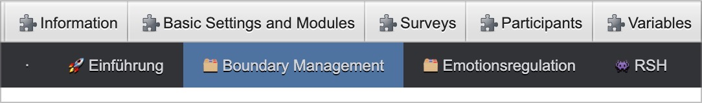
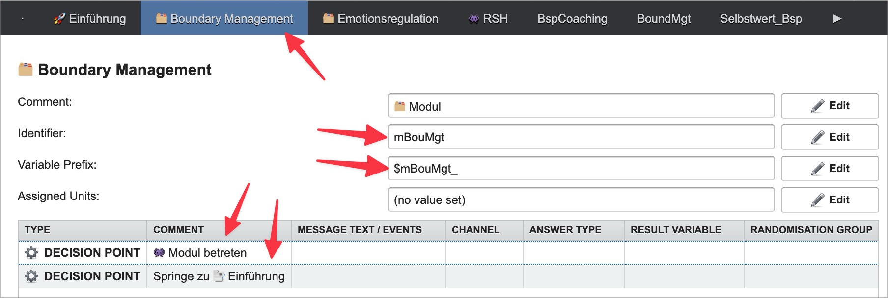
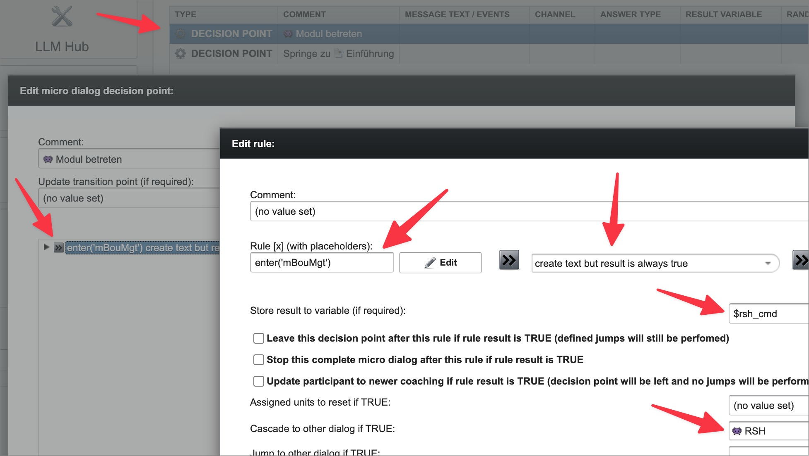
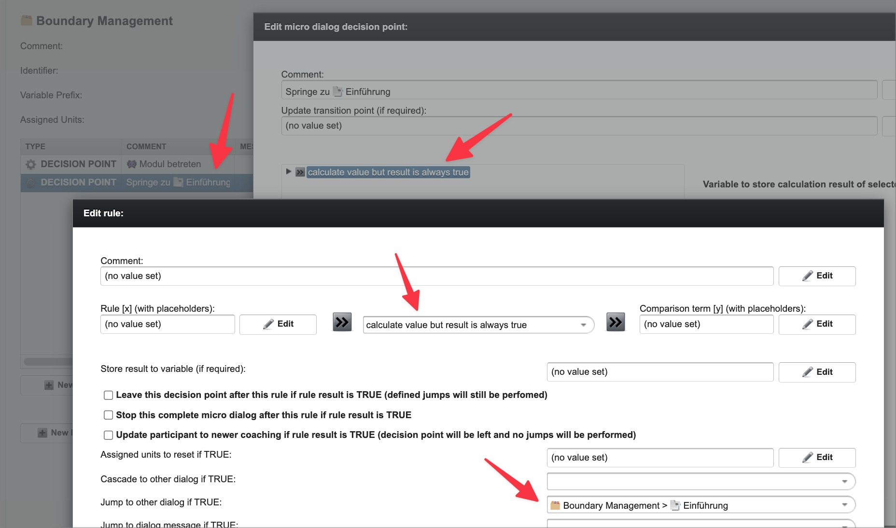
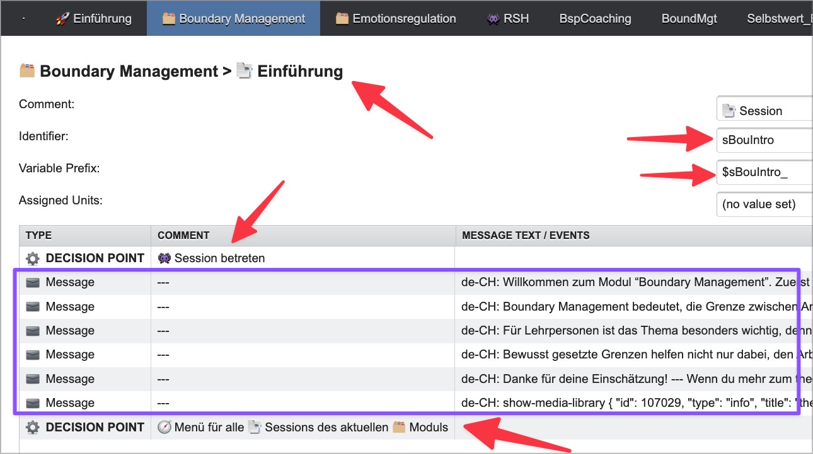
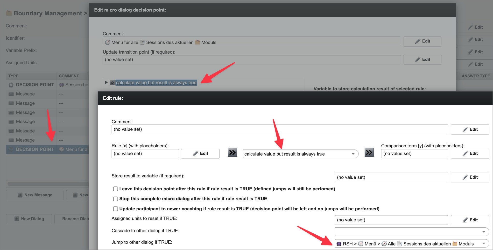
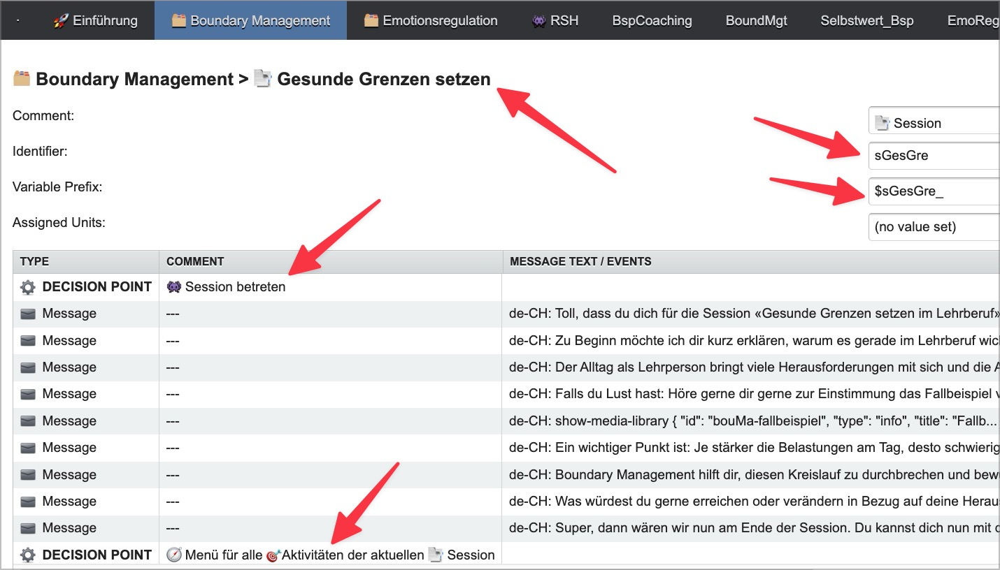
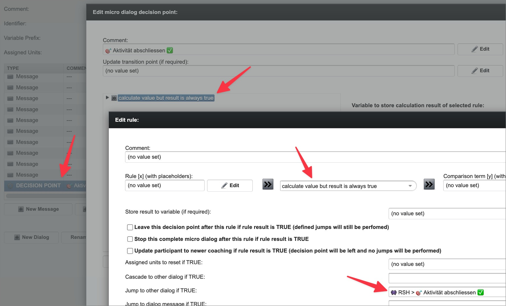

# MobileCoach Author guide

This guide is for **MobileCoach Authors** — the people who build the dialog structures in MobileCoach and fill them with content.

Be sure to also read the hands-on platform knowledge picked up while working in the MobileCoach editor: [MobileCoach field notes](mobilecoach-field-notes.md).

## Creating the dialog structure

The dialog structure mirrors the state JSON (`defaultStateTemplate()` in [`src/ReactStateHelper.js:227`](https://github.com/jmuheim/react-state-helper/blob/master/src/ReactStateHelper.js#L227)): every id in the state gets its own MobileCoach dialog.

### Module dialogs

**Module dialogs sit on the root level** of the intervention, as siblings of the "👾 RSH" dialog that holds the script — here "🗂️ Boundary Management" is the active module tab, alongside "🗂️ Emotionsregulation", and "👾 RSH":

"🚀 Einführung" is not reflected in the state JSON (it is not a "module dialog"). You can have as many additional such dialogs as you like, important is only that for each module in the state JSON, a root-level dialog is created like this:

- **Name** (the tab label): the level emoji plus the module's `title`, e.g. `🗂️ Boundary Management` — display only, routing never reads it.
- **Identifier**: the module's id exactly as in the JSON, e.g. `mBouMgt` — this is what menu routing navigates by (see [Menus](mobilecoach-admin-guide.md#menus)); an id without a matching dialog identifier pauses the flow silently ([field note](mobilecoach-field-notes.md#a-participantnextmicrodialogidentifier-without-a-matching-dialog-pauses-the-flow-silently)).
- **Variable Prefix**: the id with `$` prepended and `_` appended, e.g. `$mBouMgt_` (see [ID conventions](mobilecoach-admin-guide.md#id-conventions)).
- **Comment**: free text; we note the level, e.g. `🗂️ Modul`.

Inside, the module dialog starts with two decision points. The first runs `enter('mBouMgt')` (see [Running a command](mobilecoach-admin-guide.md#running-a-command)): its rule condition is "create text but result is always true" — a MobileCoach trick for a condition that always matches — with the rule text set to the command itself, stored to `$rsh_cmd`, and cascading to the "👾 RSH" dialog to execute the script:

The second decision point then routes onward into the module's content — no script run needed here, so it uses a variant of the same trick ("calculate value but result is always true", nothing stored to a variable), with **Jump to other dialog if TRUE** pointing directly at the module's first dialog (here `🗂️ Boundary Management > 📑 Einführung`, be sure to create it first):

### Session dialogs

Session dialogs nest **inside** their module tab (not at root level) — here `🗂️ Boundary Management > 📑 Einführung`, identifier `sBouIntro`, variable prefix `$sBouIntro_`, matching the id in the state JSON just like modules. They open with their own decision point running `enter('sBouIntro')` ("Session betreten"), followed by the session's actual content (here a purple-boxed run of intro messages), and close with a decision point that populates and shows the sessions menu (see [Menus](mobilecoach-admin-guide.md#menus)):

That closing decision point again jumps via the same trick, this time to the sessions-menu dialog under "👾 RSH", `RSH > Menü > Alle Sessions des aktuellen Moduls` — the dialog that shows the sessions menu, which must be named exactly `allSessionsOfCurrentModuleMenu` (see [Back entries](mobilecoach-admin-guide.md#back-entries)):

Regular sessions (`is_intro: false`) follow the same pattern — here `🗂️ Boundary Management > 📑 Gesunde Grenzen setzen`, identifier `sGesGre`, variable prefix `$sGesGre_` — but their closing decision point instead shows the **activities** menu:

### Activity dialogs

Activity dialogs nest one level deeper still — here `🗂️ Boundary Management > 📑 Gesunde Grenzen setzen > 🎯 Rollenwechsel bewusst gestalten`, identifier `aRolGes`, variable prefix `$aRolGes_`. They open with a decision point running `enter('aRolGes')` ("Aktivität betreten"), followed by the activity's content, and close with a decision point that marks the activity completed ("Aktivität abschliessen ✅"), calling `completeActivity()`:

That closing decision point again jumps via the same trick, this time to a shared dialog under "👾 RSH", `RSH > 🎯 Aktivität abschliessen ✅`, which runs `completeActivity()` itself — so each activity dialog only needs to jump there instead of repeating the `$rsh_cmd` plumbing seen [earlier](#module-dialogs):

