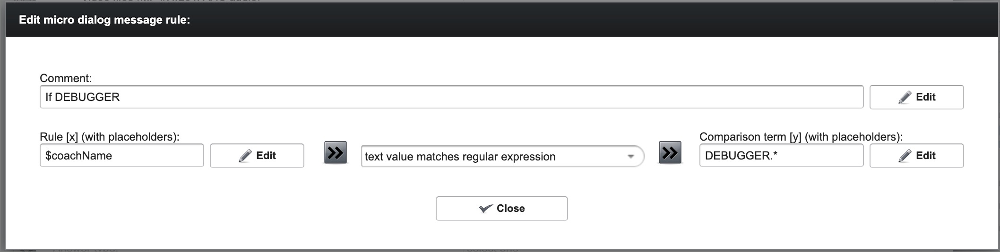

# MobileCoach field notes

Practical platform knowledge gathered while setting the library up in MobileCoach. Unlike the [platform constraints](mobilecoach-platform-constraints.md) — which drive the library's design — these notes are hands-on observations about working in the MobileCoach editor itself. Append new insights as they come up.

## Coach selection and debug coaches

When starting a session, the participant chooses a **coach**. The chosen coach's name is available to rules via the `$coachName` variable.

We use specially named coaches to show debugging info in the flow:

- `DEBUGGER` — general debug coach
- `DEBUGGER_<initial>` — one per developer, e.g. `DEBUGGER_P` (Pascal), `DEBUGGER_J` (Josua)

Flows branch on `$coachName` to decide whether to display debugging output, using a rule with operator "text value matches regular expression" and comparison term `DEBUGGER.*` (the trailing `.*` is required — a bare prefix like `DEBUGGER_` does not match):

Every DEBUGGER-facing message starts with the shared banner variable `$debugBanner` ([decision #48](decisions.md)): declared in MobileCoach with the marker `⚠️ DEBUGGER INFO ⚠️` as its **default value** (not `0`), and prepended to debug text elements on the flow side. Its sibling `$errorBanner` (default value `🚨 ERROR INFO 🚨`, [decision #50](decisions.md)) works the same way but prefixes every **error-reporting** message regardless of coach — participants see it too. The script writes and reads neither. Both marker strings exist only in those MobileCoach default values, nowhere in the repo — if the wording ever changes, update this note too.

## Saving scripts: every `$` must start a declared variable name

The script editor is a plain text field; when confirming it with "Ok", MobileCoach validates the text and rejects it with "The text contains unknown variables." if it contains a `$` that isn't immediately followed by the name of a declared variable. The scan covers the **raw text** — comments included — and isn't a JS parse: even the fragment "$-prefixed" inside a comment was rejected (`$` followed by a hyphen). The editor doesn't say which token it dislikes, so with several candidates it's a process of elimination.

For our script this means no `` ${…} `` template interpolation and no `$`-decorated pseudo-names in comments — the full rule and its enforcing test live on the [platform constraints page](mobilecoach-platform-constraints.md#script-editor-validation-on-save--only-before-declared-variable-names) (decision #27).

## Deleting a variable gives no warning about remaining references

The unknown-variable check above is the *only* guard MobileCoach has against dangling `$variable` references, and it runs only when a text or code field is **saved**. The reverse direction is unguarded: a variable can be deleted from the system without any notice like "this variable is still referenced here and there" — every text and code field that mentions it keeps its now-dangling reference silently. Since the scan re-runs only on the next save of each individual field, such stale references surface one field at a time, whenever a field happens to be edited again.

So before deleting a variable, search the dialogs for its uses manually — MobileCoach won't. Together with the raw-text `$` scan (comments included, no `${…}` interpolation) this makes the whole variable handling a naive, asymmetric affair: strict to the point of nuisance when writing, and completely hands-off when deleting.

## Menu entries split on the raw definition text, not on variable content

When a menu entry is defined as `$rsh_menuLabel1:$rsh_menuId1`, MobileCoach performs the `:`-split on the **raw definition text, before variables are interpolated** — colons that arrive inside variable values are never treated as separators.

Observed: a menu entry consisting of a single variable whose value was `Hello:test` displayed the full string `Hello:test` and produced no return value. Any post-interpolation split — first-colon or last-colon — would instead have displayed `Hello` and returned `test`, so this rules out post-interpolation splitting entirely.

Consequences:

- The former uncertainty "how does MobileCoach split an entry with multiple colons?" (sidestepped by decision #20's exactly-one-colon guarantee) is moot: only the literal `:` written in the menu definition is a split point.
- A colon inside a label would be displayed literally rather than corrupt the routing — which removes the original rationale for the library's title-colon validation; whether to drop it is now an [open question](open-questions.md#drop-the-title-colon-validation). (Caveat: the observation used a lone variable without an id part; a quick live check with the full `$rsh_menuLabel1:$rsh_menuId1` construct and a colon inside the label would make it airtight.)

## The tapped menu id lands in `$participantNextMicroDialogIdentifier`

The reserved variable that receives the right-hand side of a tapped menu entry (the part after the `:`, i.e. the dialog id) is called `$participantNextMicroDialogIdentifier`. MobileCoach then navigates to the micro dialog whose id matches its content — this is the variable behind the menu routing described above, and it can also be read in follow-up rules to branch on which entry was tapped.

## Variables are never cleaned up: stale values survive forever

MobileCoach has no lifecycle for participant variables: once something is written, it stays until something else overwrites it — the platform never resets or expires a value, even when it is clearly spent. Example: `$participantNextMicroDialogIdentifier` receives the tapped menu id (see above), but after MobileCoach has navigated to that dialog, the variable keeps its value indefinitely; it is not consumed by the jump. This appears to be the platform's general attitude, not a bug in one variable.

Consequences:

- A variable's content answers "what was written *last*", never "is this current" — branching on a variable like `$participantNextMicroDialogIdentifier` outside its immediate context may act on a value left over from a much earlier interaction.
- Any freshness guarantee has to come from our side: the library's always-write-every-run model (decision #19, reaffirmed in #37) is the countermeasure, not platform redundancy. This tension is central to the [null-init / direct-write backlog item](backlog.md#invert-the-output-flow-pre-initialise-all-variables-to-null-commands-write-results-directly): the platform won't clean up after us, so whatever the script stops overwriting simply stays stale.

## Moving between dialogs: cascading vs. jumping

Dialogs are containers of flow elements (messages, decision points, …), handled by rules one after another in sequence. There are two ways to move to another dialog, with opposite return behavior:

- **Cascading:** after the jumped-to dialog finishes, control returns to where it came from.
- **Jumping:** one-way — control does *not* return.

Unverified: what a **jump from within a cascade** does to the pending return chain — does the jump abandon the whole cascade (the stacked "go back" targets are dropped), or does the cascade's return still fire when the jumped-to dialog finishes? Needs a live test with a cascade at least two levels deep, jumping out of the innermost dialog.

(Stub — a fuller write-up of dialog internals, rule sequencing, variable writes, and if/else trees is planned; see the [flow-export backlog item](backlog.md#check-the-mobilecoach-flow-export-html-into-the-repo).)

## Dialog ids and variable prefixes: both set from the same id

Each dialog has a user-definable **id** and a user-definable **variable prefix**. The id identifies the dialog and can be used to jump to it (menu routing navigates to the dialog whose id was tapped); the prefix namespaces the dialog's variables. We set both from the same library id: the id verbatim (`mBouMgt`), the prefix with an underscore appended (`$mBouMgt_`).

The "Edit variable prefix" dialog rejects anything that doesn't match the rule "Variable prefixes always start with an `$` and only contain letters and numbers and must end with an underscore" — so exactly one underscore, at the end, and none inside. `m_bouMgt_` is rejected (internal underscore); `mBouMgt_` is accepted. Note this is stricter than variable *names*, which may contain underscores anywhere (e.g. `$rsh_json`); the restriction applies only to the prefix field.

## A `$participantNextMicroDialogIdentifier` without a matching dialog pauses the flow silently

Observed (2026-07-10): when the tapped menu id (the content of `$participantNextMicroDialogIdentifier`) names no existing dialog, nothing happens — no error, no navigation; the flow just pauses.

Consequences:

- Every id a menu can emit must have a dialog of exactly the same name — including the `allModulesMenu` back-entry target introduced by decision #38 (as `modulesMenu`; renamed in decision #43) and the `allSessionsOfCurrentModuleMenu` target introduced by decision #46. A typo'd dialog id is one more member of the silent-failure family (alongside undeclared variables): if a flow freezes right after a menu tap, compare the tapped id against the dialog ids first.
- The considered alternative of intercepting the back tap in-dialog (no dedicated dialog) would technically be possible — the flow survives the unmatched id — but was rejected in decision #38 for another reason: the modules-menu block would be duplicated into every module dialog.

## Dialog skeleton: non-module dialogs around the real modules

At the top level of the dialog structure, the *real* modules (those in the JSON data model, navigable via menus) are framed by two dialogs that look like modules in the editor but are not part of the state:

- **Einführung** — entered once at app start, never navigable again afterwards; hosts the pre-questionnaire and, currently, the `allModulesMenu` dialog as a sub-dialog (the module-selection menu the sessions menus' back entries route to — menu routing only cares about the dialog id, not where the dialog is nested). *(TODO: `allModulesMenu` probably won't stay there — the plan is to move it into the "Magic Menu" dialog, since it is called again and again from within modules; it only sits in the Einführung because that's where it is displayed first.)*
- **Abschluss** — the counterpart at the end: participants re-take the same questionnaire (post). Like the Einführung, it is not in the JSON model and cannot be reached through the library's menus.

Besides these, MobileCoach also contains an `allActivitiesOfCurrentSessionMenu` dialog — the activities-menu counterpart to `allModulesMenu` and `allSessionsOfCurrentModuleMenu`. No menu entry currently emits its id, so it is unreachable and effectively unused; it is noted here (and in a comment next to the dialog-id constants in the source) so its presence in the editor isn't mistaken for wiring.

## Copying or deleting a dialog does not include its sub-dialogs

Structural operations on a dialog act on that dialog alone — contained sub-dialogs never follow their parent:

- **Copy + paste** copies only the dialog itself with its messages, decision points, etc. — not any sub-dialogs nested inside it. After pasting, sub-dialogs must be recreated (or copied one by one) under the new parent.
- **Delete** likewise removes only the dialog itself. Its sub-dialogs are *not* deleted; they are re-aligned next to where their now-deleted parent used to be, i.e. they survive as siblings at the parent's former level.

So neither operation can be used to move or remove a whole subtree in one step — each nesting level has to be handled individually. The delete behavior also means orphaned ex-sub-dialogs can linger in the structure unnoticed after a cleanup; when deleting a parent, check its former position for surviving children.

## Deleting a referenced dialog gives no warning — references are silently reset

A dialog that other flow elements point to via **"jump to other dialog"** or **"cascade to other dialog"** can be deleted without any notice that references to it still exist. The references themselves are not left dangling but silently **reset to nothing** — every jump/cascade field that pointed to the deleted dialog is now simply empty.

Note the contrast with [variable deletion](#deleting-a-variable-gives-no-warning-about-remaining-references): a deleted variable leaves its dangling `$name` references in place (where the next save of that field at least trips the unknown-variable check), whereas a deleted dialog *erases* its references — so there is no artifact left to stumble over later, only a decision point that quietly no longer goes anywhere. That makes this the most invisible member of the silent-failure family yet: the flow doesn't error, it just stops branching where it used to.

So before deleting a dialog, search the flow for jump/cascade fields that target it and note them down — after the delete, there is no trace of what was lost. If a flow mysteriously stops moving on at a decision point, an emptied jump/cascade field from an earlier dialog deletion is a candidate.

## Pasting a decision point into another dialog forgets its "jump to other dialog" field

When a decision point is copy+pasted, the **"jump to other dialog"** field is "forgotten" — the pasted copy has no value set anymore. This happens only when pasting into a *different* dialog; pasting within the same dialog keeps the value. The very similar **"cascade to other dialog"** field is unaffected and survives the cross-dialog paste intact.

So after pasting decision points across dialogs, re-check and re-set their "jump to other dialog" fields. Two related fields — **"jump to other message"** and **"cascade to other message"** — haven't been inspected yet; whether they survive a cross-dialog paste is unknown.
